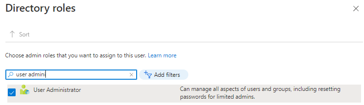

# AzureLab01

*14 de Enero de 2023*

## Objetivos

- **Tarea 1**: Crear y configurar usuarios de Azure AD.
- **Tarea 2**: Crear grupos de Azure AD con pertenencia dinámica y asignada.
- **Tarea 3**: Crear un Azure Active Directory (AD) tenant.
- **Tarea 4**: Administrar usuarios invitados de Azure AD.

## Instrucciones

### Tarea 1: Crear y configurar usuarios de Azure AD.

1. Iniciamos sesión en el [portal de Azure](https://portal.azure.com/) .
2. En Azure Portal, buscamos y seleccionamos **Azure Active Directory** .
3. En la página de Azure Active Directory, en la parte izquierda clicamos en **Users** y seleccionamos nuestra cuenta principal para ver nuestra configuración.


4. Hacemos clic en **Edit properties** y cambiamos nuestra **Usage location** a **United States** y le damos a **Save** para guardar el cambio.

   

5. Volvemos a la página de **Users - All Users** y luego hacemos clic en **+ New user**.

6. Creamos un **nuevo usuario** con la siguiente configuración (dejamos lo demás con sus valores predeterminados):

| Setting                    | Value                         |
| -------------------------- | ----------------------------- |
| User name                  | **az104-01a-aduser1**         |
| Name                       | **az104-01a-aduser1**         |
| Let me create the password | Enabled                       |
| Initial password           | **Provide a secure password** |
| Usage location             | **United States**             |
| Job title                  | **Cloud Administrator**       |
| Department                 | **IT**                        |


7. En la lista de usuarios, hacemos clic en la cuenta de usuario recién creada para mostrar su información.

8. Tendremos que copiar el **User Principal Name** ya que lo necesitaremos mas tarde.

   

9. Hacemos clic en **Assigned roles**, y clicamos en el botón **+ Add assignment** :

   

10. Y asignamos el rol de **User administrator** a nuestro usuario **az104-01a-aduser1**.

    

11. Abrimos una ventana del explorador de **Incógnito** e iniciamos sesión en [Azure Portal](https://portal.azure.com/) con la cuenta de usuario recién creada.

12. Una vez que hayamos iniciado sesión con nuestro nuevo usuario creado anteriormente (**az104-01a-aduser1**), nos vamos a **Azure AD** pinchamos en **Users** y le damos clic a **+ New user**. Recordar que la dirección para poder conectarse con ese nuevo user sería *az104-01a-aduser1@(tu correo ).onmicrosoft.com*

13. Creamos un nuevo usuario con la siguiente configuración (dejamos lo demás con sus valores predeterminados):

    | Setting                    | Value                         |
    | -------------------------- | ----------------------------- |
    | User name                  | **az104-01a-aaduser2**        |
    | Name                       | **az104-01a-aaduser2**        |
    | Let me create the password | enabled                       |
    | Initial password           | **Provide a secure password** |
    | Usage location             | **United States**             |
    | Job title                  | **System Administrator**      |
    | Department                 | **IT**                        |

### Tarea 2: Crear grupos de Azure AD con pertenencia dinámica y asignada.

1. De vuelta en el Portal de Azure donde iniciamos sesión con nuestra **cuenta de usuario principal** , navegamos de nuevo a **Azure Active Directory** y en el apartado *manage* hacemos clic en **Licenses**.
2. Hacemos clic en **All products**.
3. Pinchamos en **+ Try/Buy** y **activamos** la prueba gratuita de **Azure AD Premium P2**.


4. Actualizamos la ventana del navegador para verificar que la activación se realizó correctamente.

5. En la hoja **Licenses - All products**, pinchamos en **Azure Active Directory Premium P2**, le damos a **+ Assign** y asignamos nuestra cuenta principal y las dos que acabamos de crear.


6. En Azure Portal, volvemos a la página de Azure AD y hacemos clic en **Groups** .

7. Usamos el botón **+ New group** para crear un nuevo grupo con la siguiente configuración:

| Setting           | Value                               |
| ----------------- | ----------------------------------- |
| Group type        | **Security**                        |
| Group name        | **IT Cloud Administrators**         |
| Group description | **Contoso IT cloud administrators** |
| Membership type   | **Dynamic User**                    |


8. En la pestaña **Dynamic membership rules** , creamos una nueva regla haciendo clic en **+Add expression** con la siguiente configuración:

| Setting  | Value                   |
| -------- | ----------------------- |
| Property | **jobTitle**            |
| Operator | **Equals**              |
| Value    | **Cloud Administrator** |


9. Guardamos la regla haciendo clic en **Save** .

10. De vuelta en la hoja **Groups - All groups** hacemos clic en el botón **+ New group** y creamos un nuevo grupo con la siguiente configuración:

    | Setting           | Value                                |
    | ----------------- | ------------------------------------ |
    | Group type        | **Security**                         |
    | Group name        | **IT System Administrators**         |
    | Group description | **Contoso IT system administrators** |
    | Membership type   | **Dynamic User**                     |

    11. En la pestaña **Dynamic membership rules** , creamos una nueva regla haciendo clic en **+Add expression** con la siguiente configuración:

    | Setting  | Value                    |
    | -------- | ------------------------ |
    | Property | **jobTitle**             |
    | Operator | **Equals**               |
    | Value    | **System Administrator** |

    12. Guardamos la regla haciendo clic en **Save**.

    13. Volvemos a la hoja **Groups - All groups** hacemos clic en el botón **+ New group** y creamos un nuevo grupo con la siguiente configuración:

    | Setting           | Value                             |
    | ----------------- | --------------------------------- |
    | Group type        | **Security**                      |
    | Group name        | **IT Lab Administrators**         |
    | Group description | **Contoso IT Lab administrators** |
    | Membership type   | **Assigned**                      |

    14. Una vez que finalizamos estos procesos tendriamos que tener estos grupos creados:


Tendremos que esperar unos minutos o incluso 24h para ver que se han asignado los usuarios correctamente.

*imagen

Pasadas 24h podemos observar como los usuarios se han asignado automáticamente a sus grupos.

```
az104-01a-aduser1 aparecer en IT Cloud Administrator
```